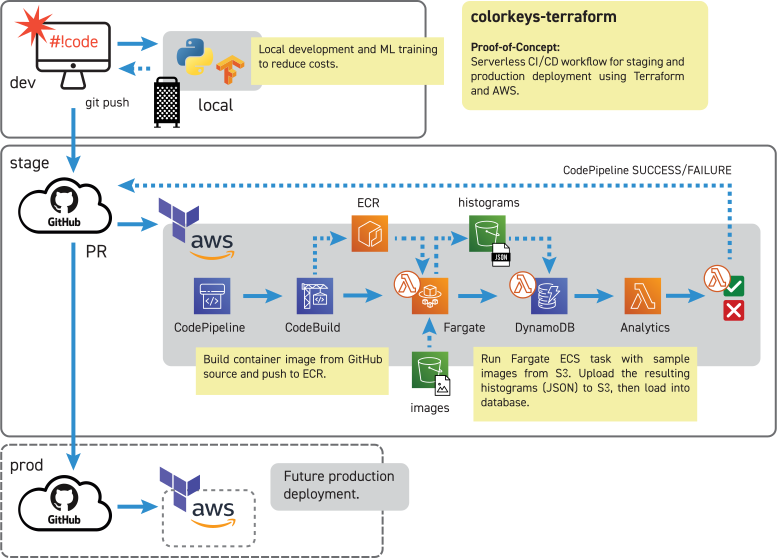

# colorkeys-terraform
Terraform modules to build, test, and deploy colorkeys

## About

This repository contains tools to build, test and deploy
[colorkeys](https://github.com/JustAddRobots/colorkeys) to AWS via Terraform.

It is part of my exploration of color palette analysis in film and art. It is 
part-exercise and part-foundational project for building data analysis and machine 
learning tools for content creation.

There is **no support** for this project.

## Requirements

* Local AWS CLI and configured credentials (~/.aws/credentials)
* Remote state table (./environment/stage/backends.tf)
* Local image samples (./infrastructure/service/pipeline/pipeline_vars.tf)

## Installing

```
Update AWS region in ./global/vars.tf

❯ cd ./environment/stage
❯ terraform plan --out /tmp/myplan.tf
❯ terraform apply /tmp/myplan.tf
```
## The Plan



## In Action

### 01 - Apply, Build

* terraform apply AWS resources
* CodePipeline starts Build, Run, Load stages
* CodeBuild builds from git commit

<P align="center">
	
</P>

### 02 - Run, Load

* Run colorkeys as Lambda Fargate ECS task
* Load colorkeys data into DynamoDB

<P align="center">
	
</P>

### 03 - Check, Destroy

* Check DynamoDB for results
* terraform destroy AWS resources

<P align="center">
	
</P>

## Todo

* Finish PASS/FAIL analytics for histogram comparision.
* Clean up dependencies, make more modular

